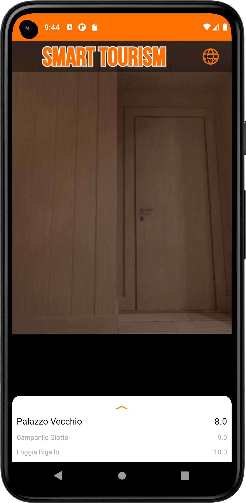
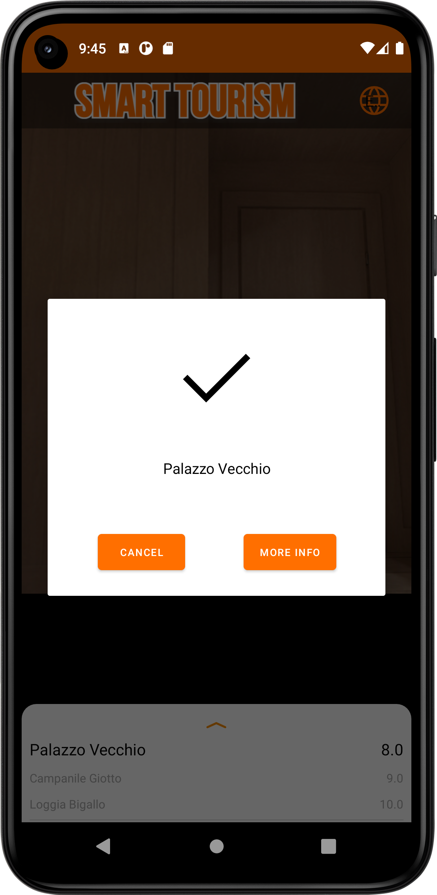
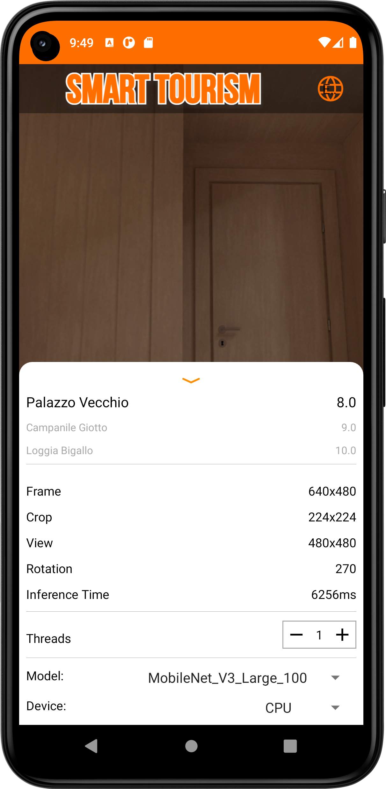

<a name="readme-top"></a>

<!-- PROJECT LOGO -->
<br />
<div align="center">
  <a href="https://github.com/lorenzo-massa/SmartTourism">
    
  </a>

  <p align="center">
    Image recognition for android devices
    <br />
    <a href="https://github.com/lorenzo-massa/SmartTourism"><strong>Explore the docs »</strong></a>
    <br />
    <br />
    <a href="https://github.com/lorenzo-massa/SmartTourism/issues">Report Bug</a>
    ·
    <a href="https://github.com/lorenzo-massa/SmartTourism/issues">Request Feature</a>
  </p>
</div>

<!-- GETTING STARTED -->
## Getting Started
<div align="center">
   &nbsp; &nbsp; &nbsp;  &nbsp; &nbsp; &nbsp;  &nbsp; &nbsp; &nbsp; 
</div>
</br>

The repository consists of two parts:
* Python
* Android

The python part is used to generate sqlite files from an image dataset and you should edit it only if you want to use another neural network or another image dataset.
The android application is ready to use and you should change it just to add files to the monuments guides.

You will find all the instuction you need just below.

### Prerequisites

Python library requires:
* numpy
* cv2
* tflite
* faiss

## Database creation
The repository contains the file `Python/build_sqlite.py` which must be executed by adding the characters `-i` or `--images` indicating the path to the dataset folder as in the following example:

```sh
python build_sqlite.py -i datasetFolderPath
```

IMPORTANT: The indicated folder must contains one folder per monument and each of which contains the images, as in the following example:

```

dataset
├───Battistero_SanGiovanni
│       img1.jpg
│       img2.jpg
│       img3.jpg
│
├───Campanile_Giotto
│       img1.jpg
│       img2.jpg
│       img3.jpg
│
├───Cattedrale_Duomo
│       img1.jpg
│       img2.jpg
│       img3.jpg
│
└───Palazzo_Vecchio
       img1.jpg
       img2.jpg
       img3.jpg

```

The file `build_sqlite.py` will create three `.sqlite` files. Each file is created with a different neural network. To change the neural network see dedicated paagraph.

IMORTANT: Do not change the names of the files created.

## Add files (audio,text,image) for monument guide
Go to the `models\src\main\assets\guides` folder. Inside it there is the folder `Template Monument` which is to be used as a template, so without altering its structure. It is only possible to change the name of the folder with the name of the monument which, however, must be the same uilized in the dataset folder.</br>
Text files, audio files and an image can be placed in this folder. The text and audio files must be placed in the folder corresponding to the language.

IMPORTANT: New files must have the same name as the files in the template folder.

NOTE: For the time being, Italian and English languages are supported.

## Add videos for the monument guide
Go to `app/src/main/res/raw`. Here you can add any video in .mp4 format.

IMPORTANT: The name of the video must not contain any spaces.

TIP: Give the video a meaningful name.

Open `app/src/main/java/org/tensorflow/lite/examples/classification/GuideActivity.java`.
Add a case to the switch construct with the name of the monument (must be the same as the name of the dataset folder), as in the example:
```java
case "Palazzo Vecchio":
                if(language.equals("English"))
                    pathVideo += R.raw.palazzo_english;
                else
                    pathVideo += R.raw.palazzo_italian;
                break;
```

Replace the name of the new english video to "palazzo_english" and the name of the new italian video to "palazzo_italian".


### ONLY FOR EXPERT USERS

## Creating the database with different neural networks
Place the neural network `.tflite` in the folders:
* Python/models
* Models/src/main/assets
Open the file `build_sqlite.py` and add the name of the neural network, including the file extension, to the "types" list. Example:

```python
types = [ #neural networks
    'MobileNetV3_Large_100',
    'MobileNetV3_Large_075',
    'MobileNetV3_Small_100',
    'newNeuralNetwork.tflite'
]
```

Run 'build_sqlite.py'.

## Using a database created with a different neural network
Go to `lib_support\src\main\java\org\tensorflow\lite\examples\classification\tflite`.
1) Create a class that extends the `Classifier` class with a name that indicates the new neural network.
TIP: Copy and paste the file "ClassifierMobileNetLarge100.java" and rename the file and class. Change the `getModelPath()` method to the filename of the new neural network.
2) Modify the file `Classifier.java` by adding a name indicating the new model as in the example:

```java
/** The model type used for classification. */
  public enum Model {
    MOBILENET_V3_LARGE_100,
    MOBILENET_V3_LARGE_075,
    MOBILENET_V3_SMALL_100,
    NEWMODEL_NAME
  }
```
3) Modify the `create(Activity, Model, Device, int)` method by adding an else if with the previously created class and model:

```java
if (model == Model.MOBILENET_V3_LARGE_100) {
      return new ClassifierMobileNetLarge100(activity, device, numThreads);
    } else if (model == Model.MOBILENET_V3_LARGE_075) {
      return new ClassifierMobileNetLarge075(activity, device, numThreads);
    } else if (model == Model.MOBILENET_V3_SMALL_100) {
      return new ClassifierMobileNetSmall100(activity, device, numThreads);
    }else if (model == Model.NEWMODEL_NAME) {
      return new ClassifierNewClassName(activity, device, numThreads);
    } else {
      throw new UnsupportedOperationException();
    }
 ```
 
4) Modify `Retrievor.java` by adding an if in the `Retrievor(Context, Cassifier.model)` constructor method as in the example:

```java
if (model == Classifier.Model.MOBILENET_V3_LARGE_100) {
            dbName = "MobileNetV3_Large_100_db.sqlite"
        } else if (model == Classifier.Model.MOBILENET_V3_LARGE_075) {
            dbName = "MobileNetV3_Large_075_db.sqlite"
        } else if (model == Classifier.Model.MOBILENET_V3_SMALL_100) {
            dbName = "MobileNetV3_Small_100_db.sqlite"
        }else if (model == Classifier.Model.NEWMODEL_NAME) {
            dbName = "newDatabaseFile_db.sqlite"
        } else {
            throw new UnsupportedOperationException();
        }
```

`newDatabaseFile.sqlite` is the new sqlite file that is the created in the previous paragraph.

5) Finally edit the file `app/src/main/res/values/strings.xml` by inserting the name of the new model in `string-array name="tfe_ic_models"` as in the example:

```xml
    <string-array name="tfe_ic_models" translatable="false">
        <item>MobileNet_V3_Large_100</item>
        <item>MobileNet_V3_Large_075</item>
        <item>MobileNet_V3_Small_100</item>
        <item>NewModel_Name</item>
    </string-array>
```

IMORTANT: The model name must be the same as entered in step 2) of this paragraph, capitalization not required.
Once you have completed these steps you can use the new model by selecting it directly in the application menu.


<!-- CONTACT -->
## Contact

Lorenzo Massa - lorenzo.massa@stud.unifi.it

Project Link: [https://github.com/lorenzo-massa/SmartTourism](https://github.com/lorenzo-massa/SmartTourism)

<p align="right">(<a href="#readme-top">back to top</a>)</p>


